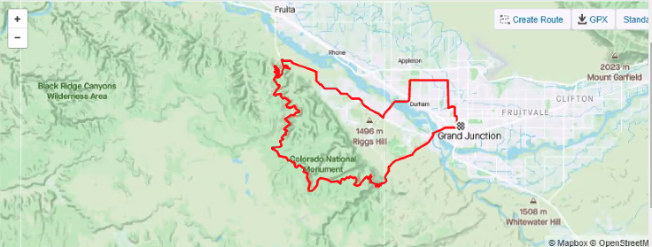

# Digital-Workout-Tracker

## General Concept:
	  Using data from individual workout activities, create a dashboard to explore
	  performance statistics.  We will leverage visualizations to enhance users understanding of their
	  workout performance.  Heart rate and speed are examples of the type of data we will leverage.

